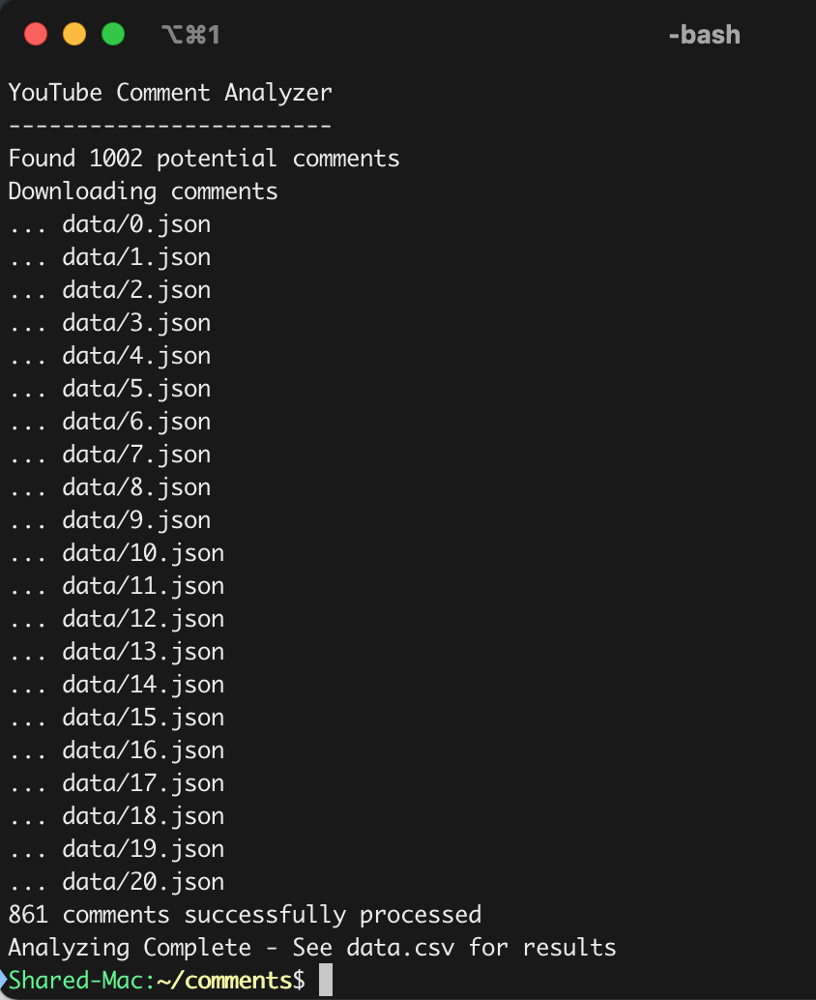

# YouTube Comment Analyzer 

YouTube offers no easy way to analyze your own comments, so I made this. After having an account and leaving comments for nearly a decade, I was curious to see some of my oldest comments and if any of them blew up.

Google allows you to download your YouTube comments, but that only gets you halfway there. Unfortunately it's given to you as an HTML file, with only links to your comments, the date posted, and the text. No like count. >:(

Did I do this all to pad my ego on a video sharing website? Yes. But I also struggled through learning Python, so I'd say it was worth it. Want to give it a try with your own comments? See below.

# How To Use

1. Go to [takeout.google.com](https://takeout.google.com)
2. Under "Select data to include", deselect all categories but "YouTube and YouTube Music"
3. Click "All YouTube data included" and change the selection to my-comments only
4. Click "Next step" and finally "Create export". You should receieve a download link in your email once the files are ready.
5. Once download, extract the Takeout folder and drop it into this directory
6. [Generate a YouTube API key](https://developers.google.com/youtube/v3/getting-started) and drop it into the placeholder spot at the top of analyze.py
6. Open your terminal, cd to this directory, and run "python analyze.py" to start the process
7. When finished, a data.json will be generated with all your comment data in json format, as well as a data.csv for ease of examining

# Notes

This project requires Python 3. Also, if you're getting any "module not found" errors, install the missing ones with "pip install {module name}" and try running it again.

Customize the resulting CSV in analyzeData(). You can sort by and display different data entirely. The default sorts from newest to oldest comments, and gives you a link to your comment, the date it was published, the number of likes it received, and the contents of said comment.

The comments will not be re-fetched once the master data.json has been been generated. If wanting to re-run the process, delete the generated data.json and data folder.

Enjoy! And in case you were curious, my top comment was 2791 likes on me calling this dog derpy.

